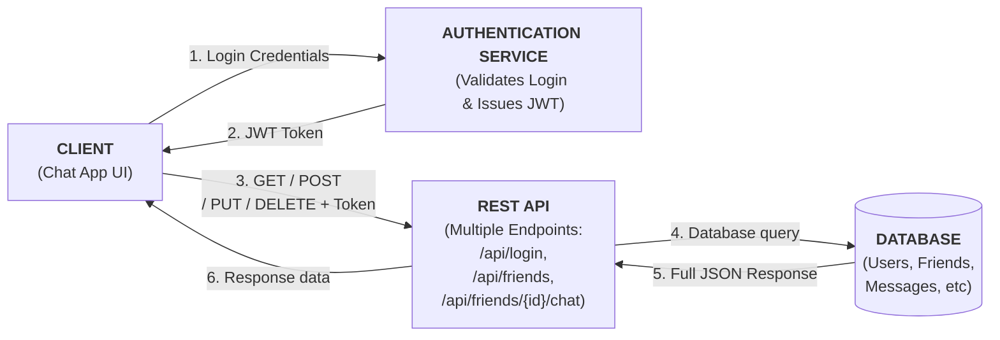
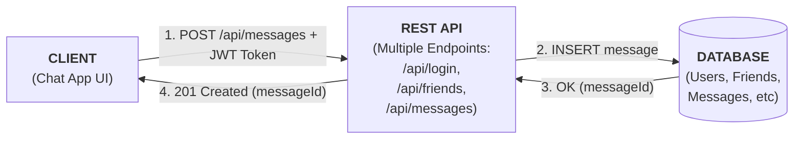
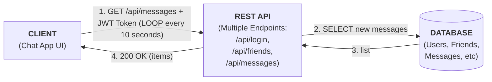
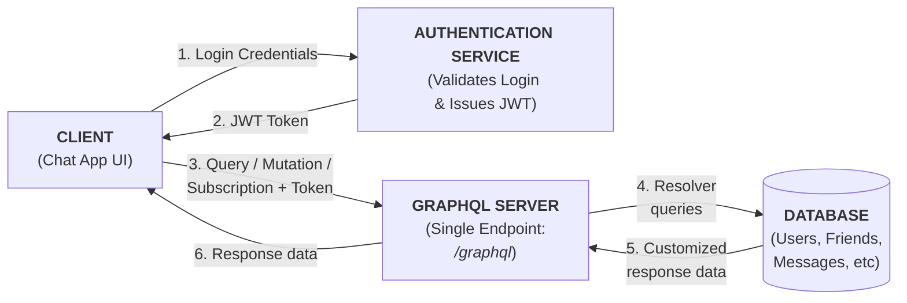
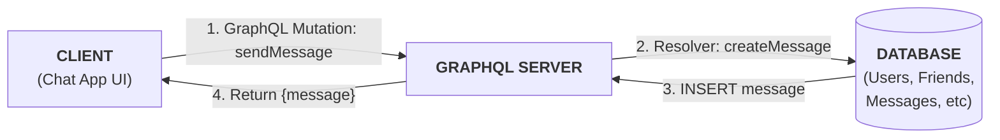
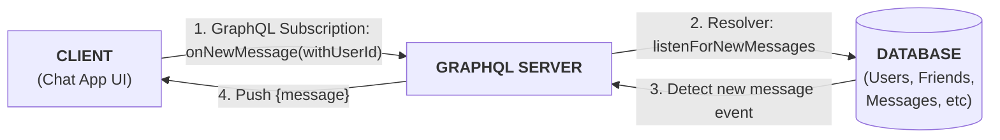
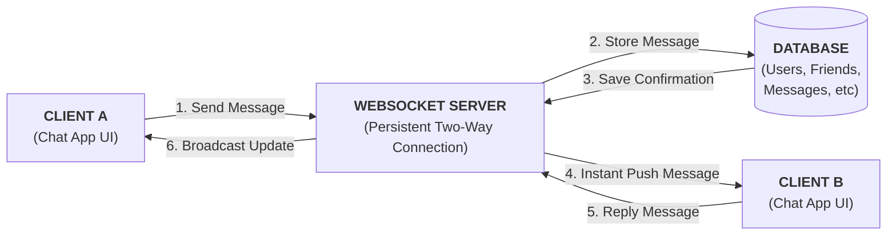

# CST8916 Assignment 1
Jigarkumar Patel, Ahmed Bodouh, Elizabeth Kaganovsky

## YouTube Presentation Link: https://youtu.be/ZBo1g7oveRo

## Section 1: REST and GraphQL for Data Requests and Updates
### 1. Rest API
**REST Approach:** 
Representational State Transfer (REST) organizes data into multiple endpoints that provide different information, such as /users, /friends, and /messages. Clients use standardized HTTP methods (GET, PUT, POST and DELETE) to perfom CRUD (Create, Read, Update, Delete) operations which retrieve and display or modify data in the database.

For safety, a good chat application should provide some form of authentication. In this application's case, JSON Web Token (JWT) is the chosen technology. JWT provides a method for clients to authenticate themselves via a compact JSON token transmitted through the URL, post parameter or inside the HTTP header [1]. When the client makes a POST request with the data of a message, the token is included in the header to identify and authenticate the host. The server can then safely process the request and respond to the client.

REST is a simple and no-nonsense solution for networked communication, but unfortunately is prone to the issues of over-fetching and under-fetching. Querying an endpoint will return a full JSON object, often with significant amounts of unneeded data, which wastes bandwidth and requires both server and client to process irrelevant data. Similarly, an endpoint may not return enough data, necessitating the client querying multiple endpoints to assemble "the full picture" of the needed data, wasting bandwidth and requiring the processing of irreelvant data as well.

Below is a high level diagram of general communication.

And below is an example of a message being sent (with authentication already complete).

Visible here is the issue of polling, where this communication must occur every ten seconds.

### 2. GraphQL API
Compared to a RESTful API using HTTP that provides fixed data shapes from multiple endpoints, GraphQL is a server layer that offers a single endpoint (/graphql) that provides flexible data shapes. A client may send a query (equivalent to a GET operation), providing a entry point (friends), argument (123) and selection set (name, avatar, status, most recent message), which GraphQL receives, processes (consulting its schema), assembles the exact data required from the appropriate data sources (using resolves), then replies to the client with the specific data requested. If a client wants to modify data (equivalent to a PUT/POST/DELETE), they will send a mutation, which follows a similar format.

The same JSON Web Token based authentication is also used in GraphQL, where the request header carries the client's authentication token, which is verified before the server processes the query/mutation.

Below is a general diagram of communication.

And below is an example of a message being sent (with authentication already complete).

In situations such as recieving messages, the issue of polling is avoided:

GraphQL also supports subscriptions, a method through which real-time operations are possible that has the server updating the client whenever new information is available. This has an odd niche--GraphQL subscriptions are often built on top of WebSockets (though they may use Server Side Events, a type of push technology), but use flexible data shapes to send precisely what data is needed, much like a hybrid of REST and WebSockets.[2]

--- 
### 3. Comparison: REST vs GraphQL for Real-Time Chat Application
| **Aspect** | **REST** | **GraphQL** |
|-------------|-----------|-------------|
| **Connection Type** | Unidirectional (client → server request) | Unidirectional (client → server request) |
| **Underlying architecture**| HTTP Based | HTTP Based [3] |
| **Endpoints** | Multiple endpoints (/auth/register, /messages, etc.) | Single endpoint (/graphql), reduces API complexity |
| **Data Fetching** | Fixed format; may over/under-fetch, but good for data structures with consistent shape (such as login information or message storage) | Client defines fields precisely, saving bandwidth and reducing processing |
| **Performance** | May need multiple requests, wasting bandwidth and requiring more processing on both the client and server side | Often fewer requests, but query performance can slow down if the schema or resolver logic becomes complicated |
| **Complexity** | Simple and intuitive for developers, adding new endpoints requires little effort. | More complex for developers to set up and maintain compared to REST, requires learning GraphQL schemas/resolvers and query language. |
| **Flexibility** | Low--Limited by endpoint design, but good API design can mitigate this somewhat | High--Allows for combination of related data (eg., user info + messages) into one query |
| **Use Case Fit** | Good for simple CRUD | Better for complex or structured data |
| **Real Time Application** | Request-response model only, real-time updates are not built-in | Built-in support for real-time updates through subscriptions |
| **Caching** | Easy to cache responses and handle authentication using tokens | Caching is much more difficult to manage (But can be done through third party libraries)[4] |

### Summary:
In summary, both REST and GraphQL can manage the chat system’s data and authentication effectively. REST is easier for simple operations such as login, sending, or storing messages, while GraphQL provides more flexibility and efficiency for retrieving related data like users and messages together. However, since both methods rely on the client requesting data, real-time updates require a separate technology such as WebSockets, which will be discussed in the next section..

## Section 2: WebSockets for Real-time Communication
In a real-time chat application, users expect messages to appear instantly without refreshing the page or waiting for new data at constant intervals. WebSockets make this possible by creating a persistent, two-way communication channel between the client and the server.

When a user opens the chat app, the client establishes a WebSocket connection with the server (This requires the establishing of an HTTP connection first, and then upgrading). Unlike REST or GraphQL, where a new connection is created for every request, WebSockets keep one open connection active for as long as the user is online. Through this, the client and server can communicate one another at the same time over a single channel.

Websockets also make for an easy way to implement chat rooms--many users can be connected to a server, which recieves new messages in real time and pushes them to all other connected clients. With no polling and no extra requests. This also keeps bandwidth use low.

WebSockets can also handle other live updates such as:
- Typing indicators (“User is typing…”).
- Online/offline user status.
- Message delivery or read receipts.

### Diagram: 

--- 

### How WebSockets Differ from REST and GraphQL:
| **Aspect** | **REST/GraphQL** | **WebSockets** |
|-------------|-----------|-------------|
| **Connection Type** | Unidirectional (client → server request) | Bidirectional (client and server can exchnage messages freely) |
| **Underlying Architecture** | HTTP-based | HTTP-based (for establishing connection), otherwise TCP[5]|
| **State type** | Stateless, server does not save client info between requests | Stateful, maintains connection until termination |
| **Updates** | Requires polling | Real-time |
| **Scalability** | Can support thousands of connections simultaneously without clogging network | Limited support for many connections |
| **Security** | Authentication performed with every message | Authentication performed once at the handshake stage |
| **Caching** | Supported (REST)/unsupported (but can be done with third party libraries)| Caching is much more difficult to manage (But can be done through third party libraries) |

## Section 3: Technology Recommendation and Justification

### Recommendation

For real-time chat application, we recommend a **hybrid approach**, using:

- **RESTful APIs** for standard CRUD operations, user authentication, and fetching message history
- **WebSockets** exclusively for managing all real-time, bidirectional communication

### Justification 
Chat applications typically have two forms of data flow--predictable, on-demand retieval and unpredictable, instantaneous data pushing. No single technology of REST APIs, GraphQL or WebSockets can solve this, so a hybrid model must be utilized.

#### Leveraging REST for Simplicity and CRUD
- As established in Section 1, REST is "simple and intuitive for developers" and "works well with standard HTTP methods"
- For actions like user registration, login, fetching chat history, and editing a profile, the request-response model is perfectly adequate and simpler to implement than GraphQL for these fixed data structures
- While GraphQL prevents over-fetching, the data requirements for a chat history or user profile are well-defined and consistent
- The complexity of setting up a GraphQL schema and resolvers is not justified for these straightforward operations, making REST the more pragmatic and "no-nonsense" choice for this part of our system

#### Leveraging WebSockets for Real-Time Core Functionality
- Section 2 conclusively demonstrated that "REST and GraphQL follow a request–response model," which is insufficient for live features
- WebSockets provide the "persistent, two-way communication channel" that is fundamental to a modern chat experience
- We will use WebSockets for the features that define real-time interaction: instant message delivery, typing indicators, and online status updates
- This eliminates the need for inefficient client-side polling and ensures "low latency and a smoother user experience"

### Why This Combination is Best Suited
#### Performance
- REST handles simple CRUD operations with minimal overhead
- WebSockets eliminate the latency and network overhead of constant HTTP polling for new messages
- The server pushes data to clients the instant it is available, making the chat feel instantaneous

#### Scalability
- The REST API and the WebSocket service can be scaled independently
- If the number of active chats grows, we can scale the WebSocket servers, while the load on the REST API for login and history might remain more consistent
- This separation of concerns prevents bottlenecks

#### Real-Time Capabilities
- By dedicating WebSockets to real-time tasks, we fully utilize their bidirectional nature
- Delivers a seamless, live communication experience that is impossible to achieve with REST or GraphQL alone
- The only technology we discussed that allows the server to initiate communication, which is a non-negotiable requirement for a chat app

#### Ease of Use for Developers
- Provides a clean and logical separation of concerns
- Developers have a clear rule: use REST for user and history management, and use WebSockets for live chat features
- This clarity simplifies both the development and maintenance of the codebase
- Reduces cognitive load compared to a more complex GraphQL setup or a convoluted polling system with REST

### Why Not GraphQL Subscriptions?
While GraphQL subscriptions merge the technology of REST and WebSockets to provide flexible content from the server in real time, there is a degree of overhead involved in implementing them. While this degree of overhead is not terribly significant (just requires the development team learn GraphQL), a well-designed REST API and WebSocket implementation can minimize the over/under-fetching issues of REST while still providing the real-time capabilities of WebSockets, without the need to learn a new query language.

### Conclusion
While both REST and GraphQL are capable of hangling data and authentication, REST is the superior partner for WebSockets in the case of a chat application. REST is simple and offers straightforward handling of standard web operations, while WebSockets offer powerful, scalable, low-latency real-time capabilities. The combinaiton of two two allows the best tool for the job to be used for every facet of communication in this system.

## Disclosures
OpenAI's ChatGPT was used in the initial drafting of this paper.

## References
**Sources:**

[1]Auth0, “JSON Web Tokens,” Auth0 Docs. https://auth0.com/docs/secure/tokens/json-web-tokens

‌[2]“Subscriptions | GraphQL,” @graphql, 2024. https://graphql.org/learn/subscriptions/

[3]“GraphQL vs REST API - Difference Between API Design Architectures - AWS,” Amazon Web Services, Inc. https://aws.amazon.com/compare/the-difference-between-graphql-and-rest/

[4]“Caching REST APIs vs. GraphQL APIs,” Stellate.co, 2022. https://stellate.co/blog/caching-rest-vs-graphql

[5]“WebSocket Protocol,” www.wallarm.com. https://www.wallarm.com/what/a-simple-explanation-of-what-a-websocket-is
