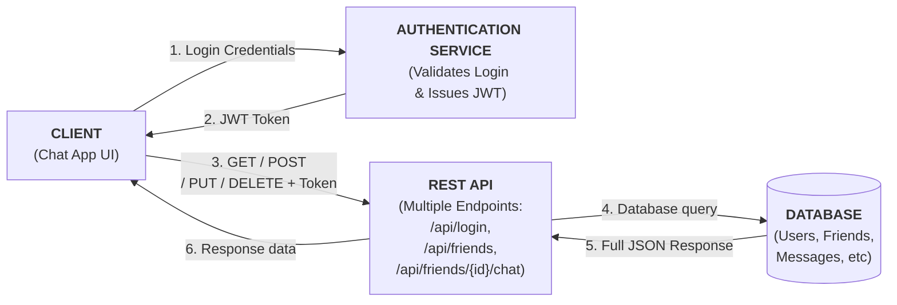
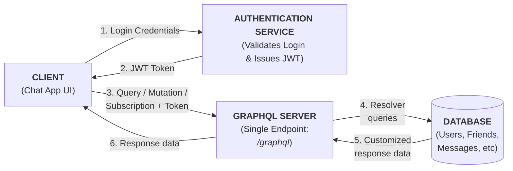

# CST8916 Assignment 1
Jigarkumar Patel, Ahmed Bodouh, Elizabeth Kaganovsky

## Section 1: REST and GraphQL for Data Requests and Updates
### 1. Rest API
**REST Approach:** 
Representational State Transfer (REST) organizes data into multiple endpoints that provide different information, such as /users, /friends, and /messages. Clients use standardized HTTP methods (GET, PUT, POST and DELETE) to perfom CRUD (Create, Read, Update, Delete) operations which retrieve and display or modify data in the database.

For safety, a good chat application should provide some form of authentication. In this application's case, JSON Web Token (JWT) is the chosen technology. JWT provides a method for clients to authenticate themselves via a compact JSON token transmitted through the URL, post parameter or inside the HTTP header [1]. When the client makes a POST request with the data of a message, the token is included in the header to identify and authenticate the host. The server can then safely process the request and respond to the client.

REST is a simple and no-nonsense solution for networked communication, but unfortunately is prone to the issues of over-fetching and under-fetching. Querying an endpoint will return a full JSON object, often with significant amounts of unneeded data, which wastes bandwidth and requires both server and client to process irrelevant data. Similarly, an endpoint may not return enough data, necessitating the client querying multiple endpoints to assemble "the full picture" of the needed data, wasting bandwidth and requiring the processing of irreelvant data as well.

### 2. GraphQL API
Compared to a RESTful API using HTTP that provides fixed data shapes from multiple endpoints, GraphQL is a server layer that offers a single endpoint (/graphql) that provides flexible data shapes. A client may send a query (equivalent to a GET operation), providing a entry point (friends), argument (123) and selection set (name, avatar, status, most recent message), which GraphQL receives, processes (consulting its schema), assembles the exact data required from the appropriate data sources (using resolves), then replies to the client with the specific data requested. If a client wants to modify data (equivalent to a PUT/POST/DELETE), they will send a mutation, which follows a similar format.

The same JSON Web Token based authentication is also used in GraphQL, where the request header carries the client's authentication token, which is verified before the server processes the query/mutation.

--- 
### Comparison: REST vs GraphQL for Real-Time Chat Application
#### REST 
**Pros**
- Simple and intuitive for developers, adding new endpoints requires little effort.
- Works well with standard HTTP methods like GET, POST, PUT, and DELETE.
- Easy to cache responses and handle authentication using tokens.
- Good for fixed data structures, such as user login or message storage.

**Cons**
- Requires multiple endpoints to handle different data (users, messages, chatrooms, etc).
- Can cause over/under-fetching, requiring more bandwidth and more processing on both server and client side.
- Request-response model only, real-time updates are not built-in.

#### GraphQL
**Pros**
- Uses a single endpoint for all operations, reducing API complexity.
- Clients can request only the fields they need, saving bandwidth and reducing processing.
- Allows for combination of related data (eg., user info + messages) into one query.
- Built-in support for real-time updates through subscriptions.

**Cons**
- More complex for developers to set up and maintain compared to REST, requires learning GraphQL schema and query language.
- Caching is more difficult to manage.
- Query performance can slow down if the schema or resolver logic becomes complicated.

### Summary:
In summary, both REST and GraphQL can manage the chat system’s data and authentication effectively.
REST is easier for simple operations such as login, sending, or storing messages, while GraphQL provides more flexibility and efficiency for retrieving related data like users and messages together.
However, since both methods rely on the client requesting data, real-time updates require a separate technology such as WebSockets, which will be discussed in the next section.

**Sources:**
[1] https://auth0.com/docs/secure/tokens/json-web-tokens 

**Consulted:**
https://www.rfc-editor.org/rfc/rfc7519

## Section 2: WebSockets for Real-time Communication
Describe how WebSockets could be used to handle real-time communication in your chosen system.

Discuss how WebSockets differ from REST and GraphQL in managing real-time data flow.

WebSockets are the most typically used protocol for real-time communication
