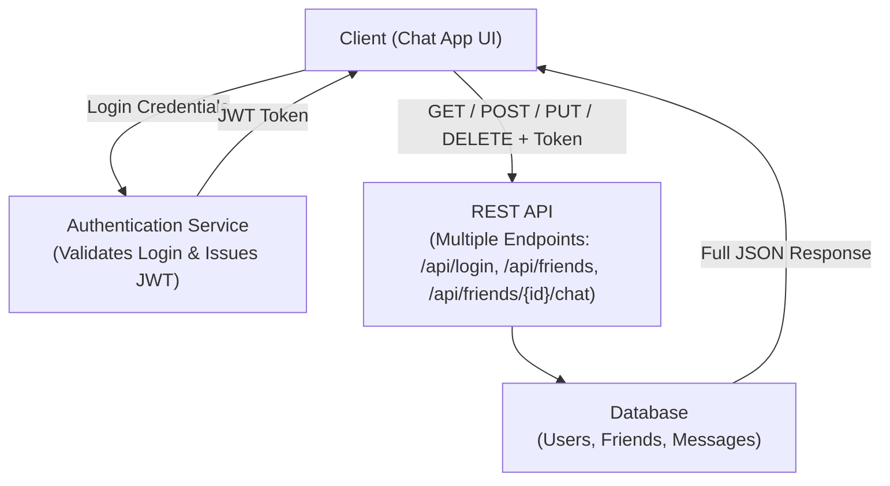
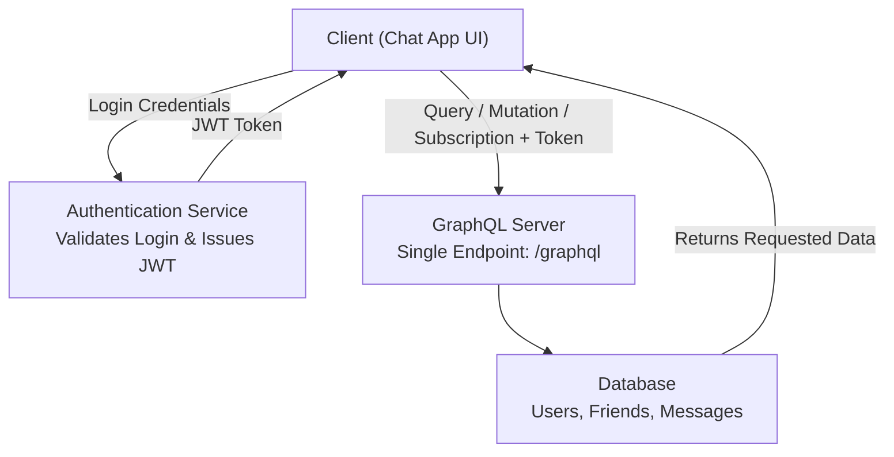

# CST8916 Assignment 1
## Jigarkumar Patel, Ahmed Bodouh, Elizabeth Kaganovsky

### Section 1: REST and GraphQL for Data Requests and Updates
 - For authentication, use HTTP (JSON Web Token)
 - Clients can message the server at the following REST endpoints:
 	- GET friends/ 
 		- Gets a list of the user's friends
 	- GET friends/123/chat
 		- Gets the chat log associated with the client and their friend as a JSON object
 	- POST friends/123/chat
 		- Post message to the associated chat
 	- PUT friends/123/chat/message
 		- Edit a message in the associated chat
 	- DELETE friends/123/chat/message
 		- Delete a message in the associated chat
 		
 		
### Section 2: WebSockets for Real-time Communication

### Section 3: Technology Recommendation and Justification

## Section 1: REST and GraphQL for Data Requests and Updates

### 1. Rest API
**REST Approach:** 
In a real-time chat application, REST organizes data through multiple endpoints, each handling specific resources such as users, friends, and messages.
Clients communicate with these endpoints using standard HTTP methods — GET, POST, PUT, and DELETE — to perform CRUD (Create, Read, Update, Delete) operations.

Each request uses a JWT token for authentication. For example, when a user sends a message, the client makes a POST request with the message data and token in the header.
The server processes the request, updates the database, and returns a JSON response.

REST is simple and easy to understand, but it can cause over-fetching or under-fetching since each endpoint sends a full JSON object, even if the client only needs part of it.

### 2. GraphQL API

GraphQL uses a single endpoint (/graphql) to handle all data operations through queries (to read data) and mutations (to modify data).
Instead of calling multiple endpoints, the client specifies exactly what data it needs; This makes it more flexible and efficient.

In GraphQL, authentication also uses the same JWT token, sent in the request header.
The server verifies the token, processes the query or mutation, and returns only the requested fields, not the full object.
This makes GraphQL more efficient and flexible than REST, especially for chat applications where data needs vary between users and devices.

--- 
### Comparison: REST vs GraphQL for Real-Time Chat Application
### REST 
1) Pros
- Simple and easy to understand for developers.
- Works well with standard HTTP methods like GET, POST, PUT, and DELETE.
- Easier to cache responses and handle authentication using tokens.
- Good for fixed data structures, such as user login or message storage.

2) Cons
- Requires multiple endpoints to handle different data (users, messages, chatrooms).
- Can cause over-fetching or under-fetching, as clients might receive more or less data than needed.
- Real-time updates are not built-in.

### GraphQL
1) Pros
- Uses a single endpoint for all operations, reducing API complexity.
- Clients can request only the fields they need, saving bandwidth.
- Easier to combine related data (for example, user info + messages) in one query.
- Built-in support for real-time updates through subscriptions.

2) Cons
- More complex to set up and maintain compared to REST.
- Caching is harder to manage.
- Query performance can slow down if the schema or resolver logic becomes complicated.
- Requires developers to learn GraphQL schema and query language.

### Summary:
In summary, both REST and GraphQL can manage the chat system’s data and authentication effectively.
REST is easier for simple operations such as login, sending, or storing messages, while GraphQL provides more flexibility and efficiency for retrieving related data like users and messages together.
However, since both methods rely on the client requesting data, real-time updates require a separate technology such as WebSockets, which will be discussed in the next section.

## Section 2: WebSockets for Real-time Communication

