# CST8916 Assignment 1
Jigarkumar Patel, Ahmed Bodouh, Elizabeth Kaganovsky

## Section 1: REST and GraphQL for Data Requests and Updates
### 1. Rest API
**REST Approach:** 
Representational State Transfer (REST) organizes data into multiple endpoints that provide different information, such as /users, /friends, and /messages. Clients use standardized HTTP methods (GET, PUT, POST and DELETE) to perfom CRUD (Create, Read, Update, Delete) operations which retrieve and display or modify data in the database.

For safety, a good chat application should provide some form of authentication. In this application's case, JSON Web Token (JWT) is the chosen technology. JWT provides a method for clients to authenticate themselves via a compact JSON token transmitted through the URL, post parameter or inside the HTTP header [1]. When the client makes a POST request with the data of a message, the token is included in the header to identify and authenticate the host. The server can then safely process the request and respond to the client.

REST is a simple and no-nonsense solution for networked communication, but unfortunately is prone to the issues of over-fetching and under-fetching. Querying an endpoint will return a full JSON object, often with significant amounts of unneeded data, which wastes bandwidth and requires both server and client to process irrelevant data. Similarly, an endpoint may not return enough data, necessitating the client querying multiple endpoints to assemble "the full picture" of the needed data, wasting bandwidth and requiring the processing of irreelvant data as well.

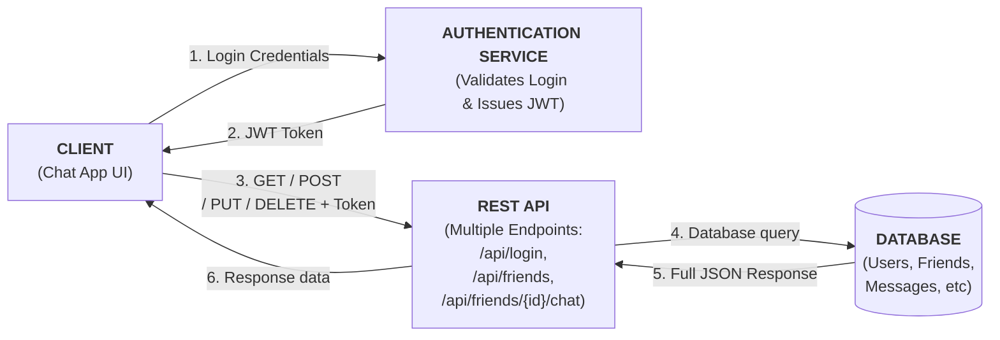
### 2. GraphQL API
Compared to a RESTful API using HTTP that provides fixed data shapes from multiple endpoints, GraphQL is a server layer that offers a single endpoint (/graphql) that provides flexible data shapes. A client may send a query (equivalent to a GET operation), providing a entry point (friends), argument (123) and selection set (name, avatar, status, most recent message), which GraphQL receives, processes (consulting its schema), assembles the exact data required from the appropriate data sources (using resolves), then replies to the client with the specific data requested. If a client wants to modify data (equivalent to a PUT/POST/DELETE), they will send a mutation, which follows a similar format.

The same JSON Web Token based authentication is also used in GraphQL, where the request header carries the client's authentication token, which is verified before the server processes the query/mutation.

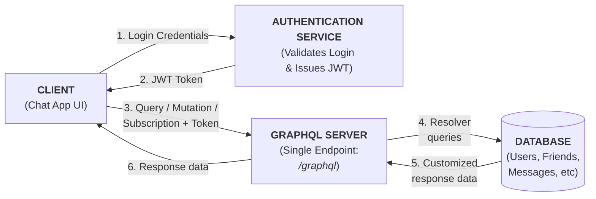
--- 
### Comparison: REST vs GraphQL for Real-Time Chat Application
#### REST 
**Pros**
- Simple and intuitive for developers, adding new endpoints requires little effort.
- Works well with standard HTTP methods like GET, POST, PUT, and DELETE.
- Easy to cache responses and handle authentication using tokens.
- Good for fixed data structures, such as user login or message storage.

**Cons**
- Requires multiple endpoints to handle different data (users, messages, chatrooms, etc).
- Can cause over/under-fetching, requiring more bandwidth and more processing on both server and client side.
- Request-response model only, real-time updates are not built-in.

#### GraphQL
**Pros**
- Uses a single endpoint for all operations, reducing API complexity.
- Clients can request only the fields they need, saving bandwidth and reducing processing.
- Allows for combination of related data (eg., user info + messages) into one query.
- Built-in support for real-time updates through subscriptions.

**Cons**
- More complex for developers to set up and maintain compared to REST, requires learning GraphQL schema and query language.
- Caching is more difficult to manage.
- Query performance can slow down if the schema or resolver logic becomes complicated.

### Summary:
In summary, both REST and GraphQL can manage the chat system’s data and authentication effectively.
REST is easier for simple operations such as login, sending, or storing messages, while GraphQL provides more flexibility and efficiency for retrieving related data like users and messages together.
However, since both methods rely on the client requesting data, real-time updates require a separate technology such as WebSockets, which will be discussed in the next section..

**Sources:**
[1] https://auth0.com/docs/secure/tokens/json-web-tokens 

**Consulted:**
https://www.rfc-editor.org/rfc/rfc7519

## Section 2: WebSockets for Real-time Communication
In a real-time chat application, users expect messages to appear instantly without refreshing the page or repeatedly requesting data.
WebSockets make this possible by creating a persistent, two-way communication channel between the client and the server.

When a user opens the chat app, the client establishes a WebSocket connection with the server.
Unlike REST or GraphQL, where a new connection is created for every request, WebSockets keep one open connection active for as long as the user is online.
This allows both the client and the server to send and receive data at any time.

For example, when User A sends a message, the client sends it to the server through the WebSocket connection.
The server immediately pushes that message to all other connected clients (such as User B) who are part of the same chat room.
This happens in real time — there’s no delay, no need for repeated polling, and no extra requests.

WebSockets can also handle other live updates such as:
- Typing indicators (“User is typing…”).
- Online/offline user status.
- Message delivery or read receipts.

Because the connection stays open, the chat system feels instant and continuous, just like popular apps such as Slack, WhatsApp, or Messenger. 

### Diagram: 
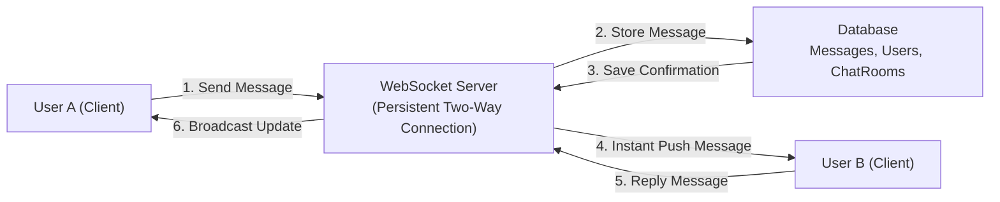

Overall, WebSockets ensure low latency, live message delivery, and a seamless real-time communication experience for all users.

--- 

### How WebSockets Differ from REST and GraphQL:

1) REST and GraphQL follow a request–response model.
- The client must send a new request every time it needs data.
- The server only responds when asked.
- For real-time updates, they rely on polling (repeatedly asking the server), which can cause delays.

2) WebSockets, on the other hand, keep a persistent, two-way connection open between the client and the server.
- The server can push data instantly to all connected clients as soon as something changes.
- This eliminates the need for polling and provides real-time updates.
3) In a chat application, this means messages, typing indicators, and online status updates appear immediately, without refreshing or reloading the page.

4) WebSockets provide low latency and a smoother user experience compared to REST or GraphQL for live communication.

   ---

# Section 1 – REST and GraphQL for Data Requests and Updates

Both REST and GraphQL are request–response models.
This means the client always initiates a request to the server, and the server only replies — there is no continuous or bidirectional connection between them.
In a live chat system, this affects how often the client must send requests to get new messages or update its data.

## A) REST Approach
How REST Works:

REST uses multiple endpoints, and each HTTP method defines the type of operation:

POST → create new data (register, login, send a message)

GET → read data (retrieve messages, user info)

PUT → update data (edit profile or message)

DELETE → remove data (delete user or message)

Each request travels one way (client → server), and the server returns a single response — nothing is pushed automatically.

## Example REST Data Flow

##  Registration
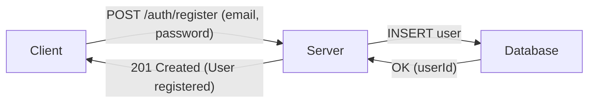
## Login
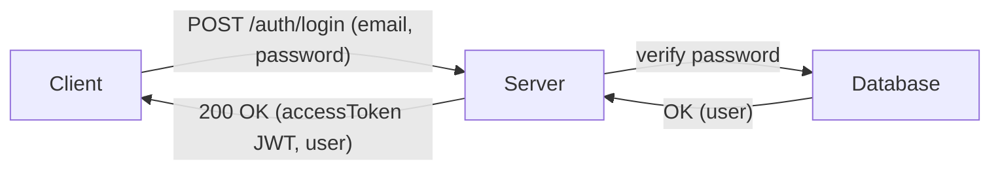
## Send message
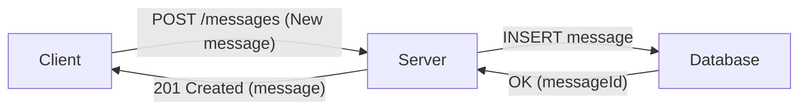
## Recieve message
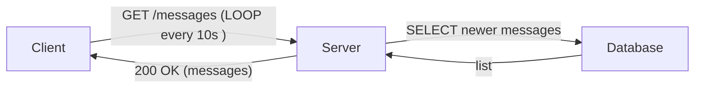
## Get Message History
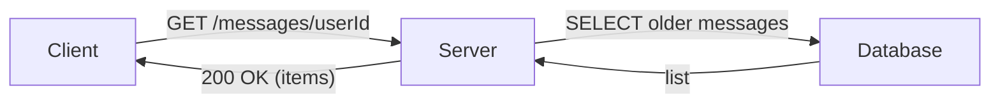

Explanation:

In REST, every action requires a new request from the client.
For a chat app, this means the client must periodically send GET requests to check for new messages because the server cannot initiate contact.

## B) GraphQL Approach
How GraphQL Works:

GraphQL also follows a request–response model, but instead of multiple URLs,
it uses a single endpoint (/graphql) for all types of operations:

Query → request (read) data

Mutation → change (write or update) data

The client defines exactly which fields it wants, and the server returns only that information — but still only when requested.
Like REST, GraphQL is not bidirectional; the client must make a new request to get updated data.

## Example GraphQL Data Flow

## Registration
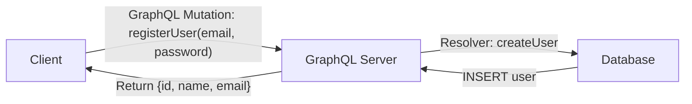
## Login
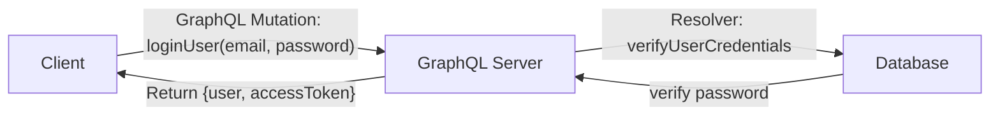
## Send message
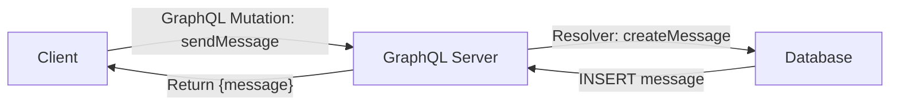
## Recieve message
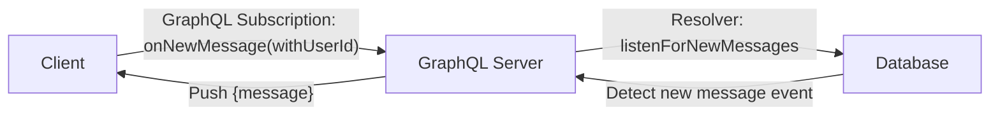
## Get Message History

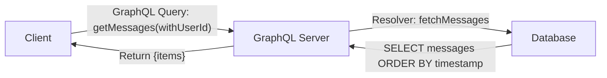

Explanation:

GraphQL also relies on client-initiated requests.
The difference is that GraphQL allows the client to choose exactly which data fields to retrieve in a single call,
reducing the number of round trips needed.

###  C) Comparison: REST vs GraphQL (Request–Response Model)

| **Aspect** | **REST** | **GraphQL** |
|-------------|-----------|-------------|
| **Connection Type** | Unidirectional (client → server request) | Unidirectional (client → server request) |
| **Endpoints** | Multiple (/auth/register, /messages, etc.) | Single (/graphql) |
| **Data Fetching** | Fixed format; may over/under-fetch | Client defines fields precisely |
| **Performance** | May need multiple requests | Often fewer requests |
| **Complexity** | Easier to implement | Needs schema and resolvers |
| **Flexibility** | Limited by endpoint design | High — client controls data shape |
| **Use Case Fit** | Good for simple CRUD | Better for complex or structured data |

